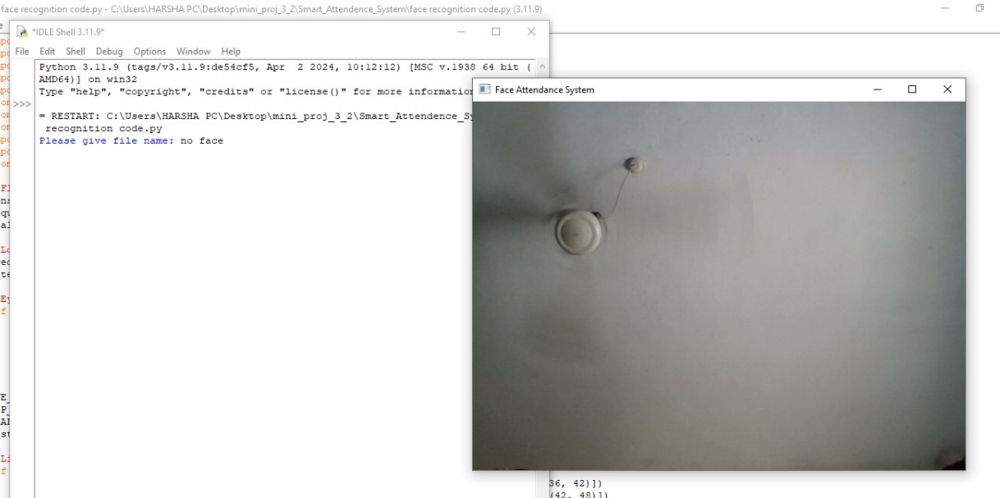
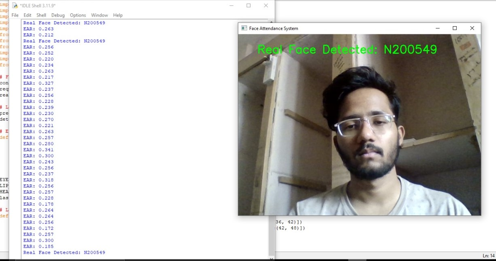
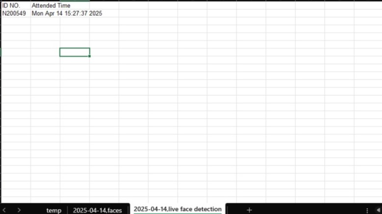
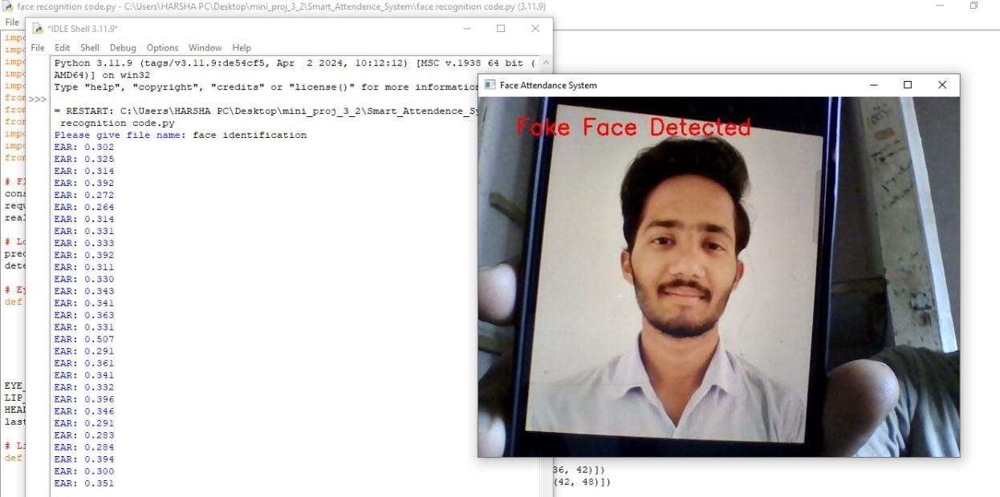

# OpenCV_based_Attendance_system_with_Facial_recognition_and_Anti_spoofing

## Overview

This project implements a **real-time face anti-spoofing system** integrated with face recognition-based **automatic attendance marking**. It is built using **Python and OpenCV**, and detects whether the face presented to the camera is live (real) or spoofed (e.g., a printed photo or digital image) by analyzing **dynamic facial features** such as:

- Eye blinking
- Head movements
- Lip movements

Upon verifying liveliness, it matches the live face against a folder of pre-stored reference faces and updates attendance in an Excel sheet.

---

## Objectives

-  Capture real-time facial data via webcam
-  Detect facial landmarks using a pretrained model
-  Verify eye blinks based on Eye Aspect Ratio (EAR)
-  Analyze head and lip movement using facial geometry
-  Match live face with stored reference images
-  Automatically update attendance in an Excel file

---

## Features

-  **Real-Time Face Detection**
-  **Dynamic Liveness Detection**
  - Eye blink detection
  - Head and lip movement validation
-  **Spoof Protection** against printed/digital photos
-  **Face Recognition** using pre-encoded known faces
-  **Excel Attendance Sheet** update on successful recognition
-  Ignores non-face inputs (walls, fans, backgrounds)

---

##  Tech Stack

- **Language:** Python
- **Libraries:** `OpenCV`, `dlib`, `face_recognition`, `numpy`, `openpyxl`
- **Model:** `shape_predictor_68_face_landmarks.dat` for landmark extraction

---

##  Folder Structure

```
Face-AntiSpoofing-Attendance/
│
├── faces/                                # Folder with reference face images
├── attendance_excel.xlsx                 # Output Excel sheet (auto-updated)
├── shape_predictor_68_face_landmarks.dat # Facial landmark model (You need to download it from online.)
├── face recognition code.py              # Main script to run the system
└── README.md                             # You're here!
```

---

##  How to Run

### 1. Clone the repository
```bash
git clone https://github.com/Harsha-2104/OpenCV_based_Facial_recognition_with_Anti_spoofing.git
cd OpenCV_based_Facial_recognition_with_Anti_spoofing
```

### 2. Install dependencies
```bash
pip install opencv-python dlib face_recognition numpy openpyxl
```

### 3. Add Reference Images
Place clear images of the people whose attendance needs to be recorded in the `faces/` folder. The filename (without extension) should be the person’s name.

### 4. Run the program

---

##  How It Works

1. **Capture**: Webcam continuously streams frames.
2. **Detection**: Face is detected and facial landmarks are extracted.
3. **Liveliness Test**:
   - Eye blink detection via EAR
   - Head/lip movement measured via frame-wise displacement
4. **Matching**: If all liveliness checks pass, system compares face with known faces using encodings.
5. **Attendance**: If matched, attendance is marked in `attendance.xls`.

---

##  Testing Scenarios

| Scenario          | Result                                        |
|-------------------|-----------------------------------------------|
| Live Face         | Attendance marked after liveness validation   |
| Spoofed Face (Photo/Image) | Rejected - no attendance update      |
| No Face / Background Only | Ignored - system waits for a face     |

---

##  Results Summary

-  **Live detection accuracy**: High under varied conditions
-  **Spoof rejection**: Successfully blocks printed or digital faces
-  **Excel updates**: Consistently updates without duplication
  







---

##  Future Enhancements

-  Port to embedded platforms like ESP32-CAM or Raspberry Pi
-  Cloud-based attendance logs and dashboard
-  Web-based admin panel for user management and config

---

##  References

- [Model for face shape predictions](https://www.kaggle.com/datasets/sergiovirahonda/shape-predictor-68-face-landmarksdat?resource=download)
- [Face Liveness Detection Using CNNs (IEEE 2021)](https://ieeexplore.ieee.org/)
- [OpenCV Documentation](https://docs.opencv.org/)
- [dlib facial landmark predictor](http://dlib.net/)

---

##  License

This project is for academic purposes. Modify and use freely with proper credit to the original authors.

---
